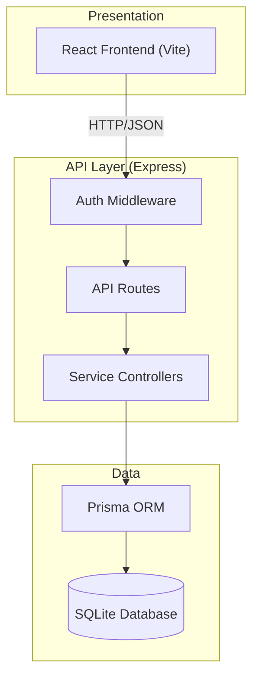
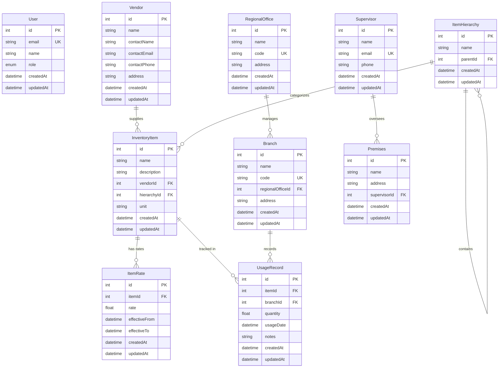
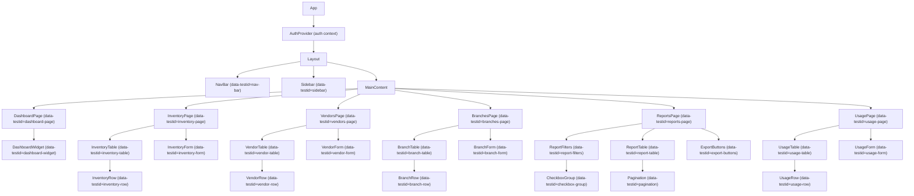
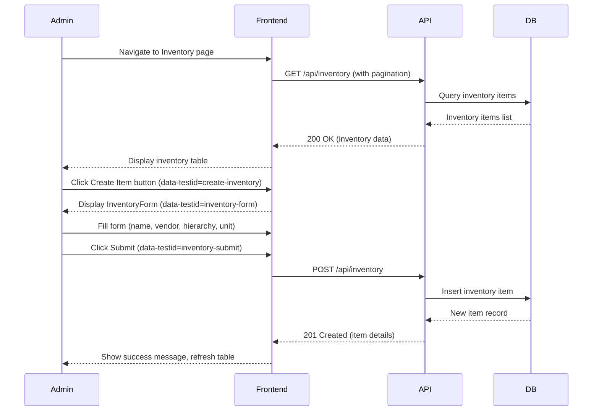
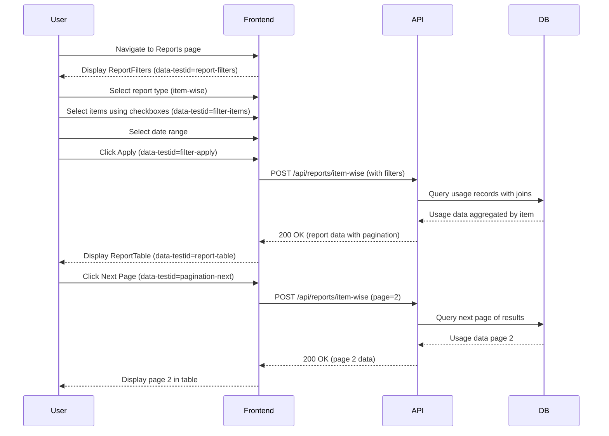
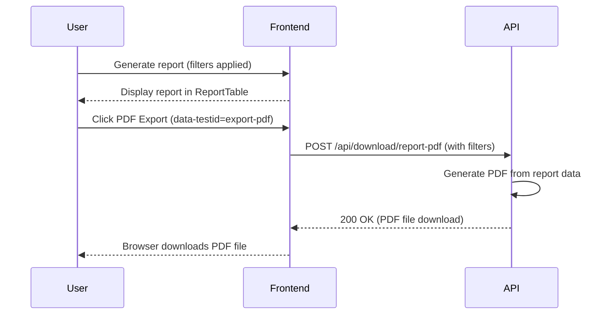
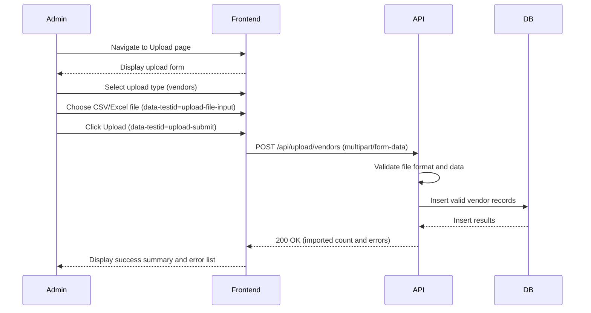
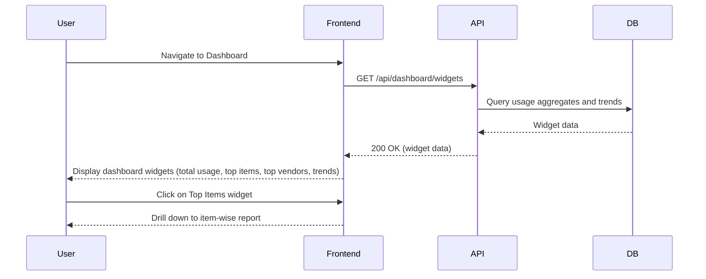
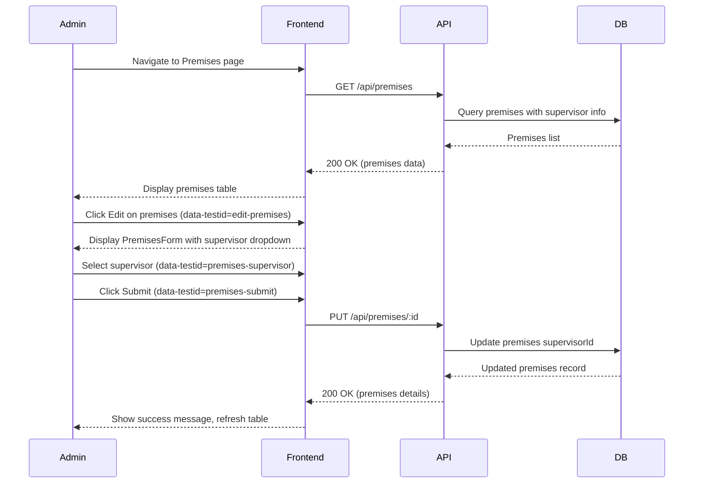

# Stationery Usage Analysis / Inventory Management — Design Document
**Date:** 2026-08-24
**Source:** BRD.md

## 1. Architecture Overview

The system follows a three-tier architecture with clear separation between presentation, API, and data layers. The React-based frontend communicates with the Express REST API via HTTP/JSON, with all routes protected by IAM-based authentication middleware. The API layer handles business logic and data operations through Prisma ORM against a SQLite database.



**Tiers:**
- **Presentation:** React single-page application with menu-based navigation, dashboard widgets, tabular reports with pagination, and role-based UI elements (FR-020, FR-019, FR-014, NFR-009)
- **API:** Express REST API enforcing authentication on all routes, role-based access control, and consistent error handling (FR-027, FR-024, NFR-001, NFR-002)
- **Data:** Prisma ORM with SQLite database managing inventory masters, organizational hierarchy, vendor data, usage tracking, and item rates (FR-001 through FR-010, FR-015)

## 2. Domain Model

### Prisma Schema

```prisma
// prisma/schema.prisma

generator client {
  provider = "prisma-client-js"
}

datasource db {
  provider = "sqlite"
  url      = env("DATABASE_URL")
}

model User {
  id        Int      @id @default(autoincrement())
  email     String   @unique
  name      String
  role      UserRole
  createdAt DateTime @default(now())
  updatedAt DateTime @updatedAt
}

enum UserRole {
  ADMIN
  USER
}

model Vendor {
  id          Int            @id @default(autoincrement())
  name        String
  contactName String?
  contactEmail String?
  contactPhone String?
  address     String?
  items       InventoryItem[]
  createdAt   DateTime       @default(now())
  updatedAt   DateTime       @updatedAt
}

model ItemHierarchy {
  id        Int              @id @default(autoincrement())
  name      String
  parentId  Int?
  parent    ItemHierarchy?   @relation("HierarchyNesting", fields: [parentId], references: [id])
  children  ItemHierarchy[]  @relation("HierarchyNesting")
  items     InventoryItem[]
  createdAt DateTime         @default(now())
  updatedAt DateTime         @updatedAt
}

model InventoryItem {
  id           Int            @id @default(autoincrement())
  name         String
  description  String?
  vendorId     Int
  vendor       Vendor         @relation(fields: [vendorId], references: [id])
  hierarchyId  Int
  hierarchy    ItemHierarchy  @relation(fields: [hierarchyId], references: [id])
  unit         String
  rates        ItemRate[]
  usageRecords UsageRecord[]
  createdAt    DateTime       @default(now())
  updatedAt    DateTime       @updatedAt
}

model ItemRate {
  id          Int           @id @default(autoincrement())
  itemId      Int
  item        InventoryItem @relation(fields: [itemId], references: [id])
  rate        Float
  effectiveFrom DateTime
  effectiveTo   DateTime?
  createdAt   DateTime      @default(now())
  updatedAt   DateTime      @updatedAt
}

model RegionalOffice {
  id        Int       @id @default(autoincrement())
  name      String
  code      String    @unique
  address   String?
  branches  Branch[]
  createdAt DateTime  @default(now())
  updatedAt DateTime  @updatedAt
}

model Branch {
  id               Int            @id @default(autoincrement())
  name             String
  code             String         @unique
  regionalOfficeId Int
  regionalOffice   RegionalOffice @relation(fields: [regionalOfficeId], references: [id])
  address          String?
  usageRecords     UsageRecord[]
  createdAt        DateTime       @default(now())
  updatedAt        DateTime       @updatedAt
}

model Supervisor {
  id        Int        @id @default(autoincrement())
  name      String
  email     String     @unique
  phone     String?
  premises  Premises[]
  createdAt DateTime   @default(now())
  updatedAt DateTime   @updatedAt
}

model Premises {
  id           Int        @id @default(autoincrement())
  name         String
  address      String?
  supervisorId Int
  supervisor   Supervisor @relation(fields: [supervisorId], references: [id])
  createdAt    DateTime   @default(now())
  updatedAt    DateTime   @updatedAt
}

model UsageRecord {
  id        Int           @id @default(autoincrement())
  itemId    Int
  item      InventoryItem @relation(fields: [itemId], references: [id])
  branchId  Int
  branch    Branch        @relation(fields: [branchId], references: [id])
  quantity  Float
  usageDate DateTime
  notes     String?
  createdAt DateTime      @default(now())
  updatedAt DateTime      @updatedAt
}
```

### Entity Relationship Diagram



### Business Rules

- **User Roles (FR-024, FR-025, FR-026):** System enforces two roles: ADMIN (full access to all masters and reports) and USER (restricted access based on role-based permissions)
- **Vendor-Item Relationship (FR-001, FR-002):** Every InventoryItem must reference exactly one Vendor; Vendor can supply multiple items
- **Item Hierarchy (FR-004):** Supports up to 4 levels of nesting via self-referential parent-child relationship; items are assigned to leaf or parent categories
- **Item Rates (FR-005):** Multiple rates per item with effective date ranges; overlapping date ranges not allowed for the same item; current rate determined by effectiveFrom/effectiveTo
- **Branch-Regional Office (FR-006, FR-007):** Each Branch belongs to exactly one RegionalOffice; RegionalOffice contains multiple branches
- **Supervisor-Premises Mapping (FR-009, FR-010):** One Premises assigned to exactly one Supervisor; Supervisor can oversee multiple Premises
- **Usage Tracking (FR-003, FR-021, FR-022):** UsageRecord captures quantity consumed per item per branch with timestamp; enables branch-level and regional-office-level aggregation

## 3. API Contracts

All API routes are prefixed with `/api/` and require authentication via IAM framework (NFR-001). Role-based access control enforced on administrative endpoints (NFR-002).

**Error Response Format:**
```json
{
  "message": "string",
  "status": "number",
  "timestamp": "string"
}
```

### Authentication & Users

| Method | Path | Description | Auth Required | Admin Only |
|--------|------|-------------|---------------|------------|
| POST | /api/auth/login | Authenticate user via IAM | No | No |
| GET | /api/auth/me | Get current user profile | Yes | No |
| GET | /api/users | List all users | Yes | Yes |
| GET | /api/users/:id | Get user by ID | Yes | Yes |
| POST | /api/users | Create new user | Yes | Yes |
| PUT | /api/users/:id | Update user | Yes | Yes |
| DELETE | /api/users/:id | Delete user | Yes | Yes |

### Inventory Management (FR-001)

| Method | Path | Description | Auth Required | Admin Only |
|--------|------|-------------|---------------|------------|
| GET | /api/inventory | List all inventory items (supports pagination, filtering by vendor, hierarchy, search) | Yes | No |
| GET | /api/inventory/:id | Get inventory item details | Yes | No |
| POST | /api/inventory | Create inventory item | Yes | Yes |
| PUT | /api/inventory/:id | Update inventory item | Yes | Yes |
| DELETE | /api/inventory/:id | Delete inventory item | Yes | Yes |

**Query Parameters for GET /api/inventory:**
- `page` (number, default: 1)
- `limit` (number, default: 20, max: 100)
- `vendorId` (number, optional)
- `hierarchyId` (number, optional)
- `search` (string, optional — searches name and description)

### Vendor Management (FR-002, FR-015)

| Method | Path | Description | Auth Required | Admin Only |
|--------|------|-------------|---------------|------------|
| GET | /api/vendors | List all vendors (supports pagination, search) | Yes | No |
| GET | /api/vendors/:id | Get vendor details | Yes | No |
| POST | /api/vendors | Create vendor | Yes | Yes |
| PUT | /api/vendors/:id | Update vendor | Yes | Yes |
| DELETE | /api/vendors/:id | Delete vendor | Yes | Yes |
| GET | /api/vendors/:id/usage-analysis | Get vendor-wise usage report (FR-015) | Yes | No |

**GET /api/vendors/:id/usage-analysis Response:**
```json
{
  "vendor": { "id": 1, "name": "Vendor A" },
  "items": [
    {
      "itemId": 1,
      "itemName": "Item X",
      "totalQuantity": 1500.5,
      "usageByBranch": [
        { "branchId": 1, "branchName": "Branch 1", "quantity": 500 }
      ]
    }
  ],
  "totalUsage": 1500.5
}
```

### Item Hierarchy Management (FR-004, FR-023)

| Method | Path | Description | Auth Required | Admin Only |
|--------|------|-------------|---------------|------------|
| GET | /api/hierarchies | List all hierarchies (tree structure) | Yes | No |
| GET | /api/hierarchies/:id | Get hierarchy node details | Yes | No |
| POST | /api/hierarchies | Create hierarchy node | Yes | Yes |
| PUT | /api/hierarchies/:id | Update hierarchy node | Yes | Yes |
| DELETE | /api/hierarchies/:id | Delete hierarchy node | Yes | Yes |

### Item Rate Management (FR-005)

| Method | Path | Description | Auth Required | Admin Only |
|--------|------|-------------|---------------|------------|
| GET | /api/rates | List all rates (filterable by itemId) | Yes | No |
| GET | /api/rates/:id | Get rate details | Yes | No |
| POST | /api/rates | Create rate | Yes | Yes |
| PUT | /api/rates/:id | Update rate | Yes | Yes |
| DELETE | /api/rates/:id | Delete rate | Yes | Yes |

### Branch & Regional Office Management (FR-006, FR-007, FR-021, FR-022)

| Method | Path | Description | Auth Required | Admin Only |
|--------|------|-------------|---------------|------------|
| GET | /api/regional-offices | List all regional offices (supports pagination) | Yes | No |
| GET | /api/regional-offices/:id | Get regional office details | Yes | No |
| POST | /api/regional-offices | Create regional office | Yes | Yes |
| PUT | /api/regional-offices/:id | Update regional office | Yes | Yes |
| DELETE | /api/regional-offices/:id | Delete regional office | Yes | Yes |
| GET | /api/branches | List all branches (supports pagination, filter by regionalOfficeId) | Yes | No |
| GET | /api/branches/:id | Get branch details | Yes | No |
| POST | /api/branches | Create branch | Yes | Yes |
| PUT | /api/branches/:id | Update branch | Yes | Yes |
| DELETE | /api/branches/:id | Delete branch | Yes | Yes |

### Supervisor & Premises Management (FR-008, FR-009, FR-010)

| Method | Path | Description | Auth Required | Admin Only |
|--------|------|-------------|---------------|------------|
| GET | /api/supervisors | List all supervisors | Yes | No |
| GET | /api/supervisors/:id | Get supervisor details with assigned premises | Yes | No |
| POST | /api/supervisors | Create supervisor | Yes | Yes |
| PUT | /api/supervisors/:id | Update supervisor | Yes | Yes |
| DELETE | /api/supervisors/:id | Delete supervisor | Yes | Yes |
| GET | /api/premises | List all premises | Yes | No |
| GET | /api/premises/:id | Get premises details | Yes | No |
| POST | /api/premises | Create premises with supervisor assignment | Yes | Yes |
| PUT | /api/premises/:id | Update premises | Yes | Yes |
| DELETE | /api/premises/:id | Delete premises | Yes | Yes |

### Usage Tracking & Reporting (FR-003, FR-011, FR-012, FR-013, FR-014, FR-021, FR-022, FR-023)

| Method | Path | Description | Auth Required | Admin Only |
|--------|------|-------------|---------------|------------|
| GET | /api/usage | List usage records (supports pagination, filtering by date range, branches, items, regional offices) | Yes | No |
| GET | /api/usage/:id | Get usage record details | Yes | No |
| POST | /api/usage | Create usage record | Yes | No |
| PUT | /api/usage/:id | Update usage record | Yes | Yes |
| DELETE | /api/usage/:id | Delete usage record | Yes | Yes |
| POST | /api/reports/item-wise | Generate item-wise usage report (FR-003, FR-013) | Yes | No |
| POST | /api/reports/branch-wise | Generate branch-wise usage report (FR-011, FR-021) | Yes | No |
| POST | /api/reports/regional-office-wise | Generate regional-office-wise usage report (FR-012, FR-022) | Yes | No |
| POST | /api/reports/hierarchy-wise | Generate hierarchy-wise usage report (FR-023) | Yes | No |
| POST | /api/reports/vendor-wise | Generate vendor-wise usage report (FR-015) | Yes | No |

**POST /api/reports/item-wise Request:**
```json
{
  "itemIds": [1, 2, 3],
  "branchIds": [1, 5, 10],
  "regionalOfficeIds": [1, 2],
  "startDate": "2026-01-01",
  "endDate": "2026-08-24",
  "page": 1,
  "limit": 20
}
```

**POST /api/reports/item-wise Response:**
```json
{
  "data": [
    {
      "itemId": 1,
      "itemName": "A4 Paper",
      "vendor": "Vendor A",
      "totalQuantity": 5000,
      "usageByBranch": [
        { "branchId": 1, "branchName": "Branch 1", "quantity": 1500 }
      ]
    }
  ],
  "pagination": {
    "page": 1,
    "limit": 20,
    "total": 3,
    "totalPages": 1
  }
}
```

### Data Upload & Download (FR-016, FR-017, FR-018)

| Method | Path | Description | Auth Required | Admin Only |
|--------|------|-------------|---------------|------------|
| POST | /api/upload/inventory | Upload inventory items (CSV/Excel) | Yes | Yes |
| POST | /api/upload/vendors | Upload vendors (CSV/Excel) | Yes | Yes |
| POST | /api/upload/branches | Upload branches (CSV/Excel) | Yes | Yes |
| POST | /api/upload/usage | Upload usage records (CSV/Excel) | Yes | Yes |
| GET | /api/download/report | Download report as CSV/Excel (query param: format=csv or excel) | Yes | No |
| POST | /api/download/report-pdf | Generate and download report as PDF | Yes | No |

**POST /api/upload/inventory Request:**
- Content-Type: multipart/form-data
- Body: file (CSV or Excel)

**POST /api/upload/inventory Response:**
```json
{
  "success": true,
  "imported": 150,
  "failed": 2,
  "errors": [
    { "row": 5, "message": "Vendor ID 999 not found" }
  ]
}
```

### Dashboard (FR-019)

| Method | Path | Description | Auth Required | Admin Only |
|--------|------|-------------|---------------|------------|
| GET | /api/dashboard/widgets | Get dashboard widget data (total usage, top items, top vendors, usage trends) | Yes | No |

**GET /api/dashboard/widgets Response:**
```json
{
  "totalUsage": {
    "currentMonth": 125000,
    "previousMonth": 118000,
    "changePercent": 5.9
  },
  "topItems": [
    { "itemId": 1, "itemName": "A4 Paper", "quantity": 15000 },
    { "itemId": 2, "itemName": "Pens", "quantity": 12000 }
  ],
  "topVendors": [
    { "vendorId": 1, "vendorName": "Vendor A", "totalValue": 450000 }
  ],
  "usageTrend": [
    { "month": "2026-01", "totalQuantity": 100000 },
    { "month": "2026-02", "totalQuantity": 105000 }
  ]
}
```

## 4. Component Structure

The React frontend follows a component-based architecture with menu-based navigation, dashboard widgets, and tabular reports. All interactive elements include `data-testid` attributes for automated testing.

### Component Hierarchy



### Key Components & Test Identifiers

**Layout & Navigation:**
- `NavBar` (data-testid=nav-bar) — Top navigation with logo and user menu
- `Sidebar` (data-testid=sidebar) — Menu-based navigation to all functional areas (FR-020)
- `MainContent` — Router outlet for page components

**Dashboard (FR-019):**
- `DashboardPage` (data-testid=dashboard-page)
- `DashboardWidget` (data-testid=dashboard-widget) — Individual widget component for metrics
  - Widget types: total-usage (data-testid=widget-total-usage), top-items (data-testid=widget-top-items), top-vendors (data-testid=widget-top-vendors), usage-trend (data-testid=widget-usage-trend)

**Inventory Management (FR-001):**
- `InventoryPage` (data-testid=inventory-page)
- `InventoryTable` (data-testid=inventory-table) — Paginated table (FR-014)
- `InventoryRow` (data-testid=inventory-row) — Table row with edit/delete actions
- `InventoryForm` (data-testid=inventory-form) — Create/edit form
  - Fields: name (data-testid=inventory-name), description (data-testid=inventory-description), vendor select (data-testid=inventory-vendor), hierarchy select (data-testid=inventory-hierarchy), unit (data-testid=inventory-unit)
  - Actions: submit (data-testid=inventory-submit), cancel (data-testid=inventory-cancel)

**Vendor Management (FR-002, FR-015):**
- `VendorsPage` (data-testid=vendors-page)
- `VendorTable` (data-testid=vendor-table)
- `VendorRow` (data-testid=vendor-row)
- `VendorForm` (data-testid=vendor-form)
  - Fields: name (data-testid=vendor-name), contact name (data-testid=vendor-contact-name), contact email (data-testid=vendor-contact-email), contact phone (data-testid=vendor-contact-phone), address (data-testid=vendor-address)

**Branch & Regional Office Management (FR-006, FR-007):**
- `BranchesPage` (data-testid=branches-page)
- `BranchTable` (data-testid=branch-table)
- `BranchRow` (data-testid=branch-row)
- `BranchForm` (data-testid=branch-form)
  - Fields: name (data-testid=branch-name), code (data-testid=branch-code), regional office select (data-testid=branch-regional-office), address (data-testid=branch-address)

**Usage Tracking (FR-003):**
- `UsagePage` (data-testid=usage-page)
- `UsageTable` (data-testid=usage-table)
- `UsageRow` (data-testid=usage-row)
- `UsageForm` (data-testid=usage-form)
  - Fields: item select (data-testid=usage-item), branch select (data-testid=usage-branch), quantity (data-testid=usage-quantity), usage date (data-testid=usage-date), notes (data-testid=usage-notes)

**Reports (FR-011, FR-012, FR-013, FR-014, FR-015, FR-017, FR-018, FR-021, FR-022, FR-023):**
- `ReportsPage` (data-testid=reports-page)
- `ReportFilters` (data-testid=report-filters) — Filters section with multi-select checkboxes
  - Branch multi-select (data-testid=filter-branches) with checkboxes (FR-011)
  - Regional office multi-select (data-testid=filter-regional-offices) with checkboxes (FR-012)
  - Item multi-select (data-testid=filter-items) with checkboxes (FR-013)
  - Date range picker: start date (data-testid=filter-start-date), end date (data-testid=filter-end-date)
  - Report type selector (data-testid=filter-report-type): item-wise, branch-wise, regional-office-wise, hierarchy-wise, vendor-wise
  - Apply button (data-testid=filter-apply)
- `CheckboxGroup` (data-testid=checkbox-group) — Reusable checkbox multi-selector
  - Individual checkbox items use data-testid=checkbox-item-{id}
- `ReportTable` (data-testid=report-table) — Paginated table displaying report results (FR-014)
- `Pagination` (data-testid=pagination) — Pagination controls
  - Previous button (data-testid=pagination-prev)
  - Next button (data-testid=pagination-next)
  - Page number buttons (data-testid=pagination-page-{number})
- `ExportButtons` (data-testid=export-buttons)
  - CSV export (data-testid=export-csv) (FR-017)
  - Excel export (data-testid=export-excel) (FR-017)
  - PDF export (data-testid=export-pdf) (FR-018)

**Upload (FR-016):**
- `UploadPage` (data-testid=upload-page)
- File upload input (data-testid=upload-file-input)
- Upload type selector (data-testid=upload-type): inventory, vendors, branches, usage
- Upload submit button (data-testid=upload-submit)

**Role-Based UI Elements (FR-024, FR-025, FR-026):**
- Admin-only actions (create, edit, delete buttons) conditionally rendered based on user role
- Admin-only menu items (User Management, Upload) hidden for USER role

## 5. Key User Flows

### Flow 1: Admin Creates Inventory Item (FR-001, FR-002, FR-004)



### Flow 2: User Generates Item-Wise Usage Report (FR-003, FR-013, FR-014)



### Flow 3: User Exports Report to PDF (FR-018)



### Flow 4: Admin Uploads Vendor Data (FR-016)



### Flow 5: User Views Dashboard (FR-019)



### Flow 6: Admin Maps Premises to Supervisor (FR-010)



## 6. Seed Data Plan

### Users (FR-024, FR-025)
- **Admin User:** email=admin@stationery.local, name="System Admin", role=ADMIN
- **Regular User:** email=user@stationery.local, name="Branch User", role=USER
- **Regional Manager:** email=manager@stationery.local, name="Regional Manager", role=USER

### Vendors (FR-002)
- **Vendor 1:** name="Office Supplies Co", contactName="John Doe", contactEmail="john@officesupplies.com", contactPhone="+91-1234567890"
- **Vendor 2:** name="Stationery Plus", contactName="Jane Smith", contactEmail="jane@stationeryplus.com", contactPhone="+91-9876543210"
- **Vendor 3:** name="Paper World", contactName="Bob Johnson", contactEmail="bob@paperworld.com", contactPhone="+91-5555555555"

### Item Hierarchies (FR-004)
- **Level 1 - Writing Instruments:** parentId=null
  - **Level 2 - Pens:** parentId=Writing Instruments
  - **Level 2 - Pencils:** parentId=Writing Instruments
- **Level 1 - Paper Products:** parentId=null
  - **Level 2 - Copy Paper:** parentId=Paper Products
    - **Level 3 - A4 Paper:** parentId=Copy Paper
    - **Level 3 - Legal Paper:** parentId=Copy Paper
  - **Level 2 - Notebooks:** parentId=Paper Products
- **Level 1 - Office Supplies:** parentId=null
  - **Level 2 - Staplers:** parentId=Office Supplies
  - **Level 2 - Files & Folders:** parentId=Office Supplies

### Inventory Items (FR-001)
- **Item 1:** name="Blue Ballpoint Pen", vendorId=1, hierarchyId=Pens, unit="piece"
- **Item 2:** name="A4 Copy Paper (500 sheets)", vendorId=3, hierarchyId=A4 Paper, unit="ream"
- **Item 3:** name="HB Pencil", vendorId=1, hierarchyId=Pencils, unit="piece"
- **Item 4:** name="Stapler (Standard)", vendorId=2, hierarchyId=Staplers, unit="piece"
- **Item 5:** name="Spiral Notebook (200 pages)", vendorId=2, hierarchyId=Notebooks, unit="piece"

### Item Rates (FR-005)
- **Rate 1:** itemId=1 (Blue Pen), rate=5.00, effectiveFrom=2026-01-01, effectiveTo=null
- **Rate 2:** itemId=2 (A4 Paper), rate=250.00, effectiveFrom=2026-01-01, effectiveTo=2026-06-30
- **Rate 3:** itemId=2 (A4 Paper), rate=275.00, effectiveFrom=2026-07-01, effectiveTo=null (price increase)
- **Rate 4:** itemId=3 (Pencil), rate=3.00, effectiveFrom=2026-01-01, effectiveTo=null
- **Rate 5:** itemId=4 (Stapler), rate=150.00, effectiveFrom=2026-01-01, effectiveTo=null
- **Rate 6:** itemId=5 (Notebook), rate=45.00, effectiveFrom=2026-01-01, effectiveTo=null

### Regional Offices (FR-007)
- **Regional Office 1:** name="North Region", code="NR-01", address="123 North Street, Delhi"
- **Regional Office 2:** name="South Region", code="SR-01", address="456 South Avenue, Bangalore"
- **Regional Office 3:** name="East Region", code="ER-01", address="789 East Road, Kolkata"
- **Regional Office 4:** name="West Region", code="WR-01", address="321 West Boulevard, Mumbai"

### Branches (FR-006) — Sample from ~1,500
- **Branch 1:** name="Delhi Central Branch", code="DCB-001", regionalOfficeId=1, address="Central Delhi"
- **Branch 2:** name="Delhi North Branch", code="DNB-002", regionalOfficeId=1, address="North Delhi"
- **Branch 3:** name="Delhi South Branch", code="DSB-003", regionalOfficeId=1, address="South Delhi"
- **Branch 4:** name="Bangalore Main Branch", code="BMB-001", regionalOfficeId=2, address="MG Road, Bangalore"
- **Branch 5:** name="Bangalore East Branch", code="BEB-002", regionalOfficeId=2, address="Whitefield, Bangalore"
- **Branch 6:** name="Kolkata Central Branch", code="KCB-001", regionalOfficeId=3, address="Park Street, Kolkata"
- **Branch 7:** name="Mumbai Western Branch", code="MWB-001", regionalOfficeId=4, address="Andheri, Mumbai"
- **Branch 8:** name="Mumbai Suburban Branch", code="MSB-002", regionalOfficeId=4, address="Thane, Mumbai"
- *(Seed file should include at least 20-30 branches across all regional offices to demonstrate multi-branch reporting)*

### Supervisors (FR-009)
- **Supervisor 1:** name="Amit Kumar", email="amit.kumar@company.com", phone="+91-9999999991"
- **Supervisor 2:** name="Priya Sharma", email="priya.sharma@company.com", phone="+91-9999999992"
- **Supervisor 3:** name="Rajesh Gupta", email="rajesh.gupta@company.com", phone="+91-9999999993"

### Premises (FR-008, FR-010)
- **Premises 1:** name="Head Office Delhi", supervisorId=1, address="Connaught Place, Delhi"
- **Premises 2:** name="Regional Office North", supervisorId=1, address="Rohini, Delhi"
- **Premises 3:** name="Regional Office South", supervisorId=2, address="Koramangala, Bangalore"
- **Premises 4:** name="Regional Office East", supervisorId=3, address="Salt Lake, Kolkata"
- **Premises 5:** name="Regional Office West", supervisorId=3, address="Bandra, Mumbai"

### Usage Records (FR-003, FR-021, FR-022)
- **Record 1:** itemId=1 (Blue Pen), branchId=1, quantity=500, usageDate=2026-08-01, notes="Monthly office supply"
- **Record 2:** itemId=2 (A4 Paper), branchId=1, quantity=50, usageDate=2026-08-01, notes="Printing department"
- **Record 3:** itemId=3 (Pencil), branchId=2, quantity=200, usageDate=2026-08-05, notes="Branch replenishment"
- **Record 4:** itemId=1 (Blue Pen), branchId=3, quantity=300, usageDate=2026-08-10, notes="Customer service desk"
- **Record 5:** itemId=4 (Stapler), branchId=4, quantity=25, usageDate=2026-08-12, notes="New branch setup"
- **Record 6:** itemId=5 (Notebook), branchId=5, quantity=100, usageDate=2026-08-15, notes="Training materials"
- **Record 7:** itemId=2 (A4 Paper), branchId=6, quantity=75, usageDate=2026-08-18, notes="Marketing campaign"
- **Record 8:** itemId=1 (Blue Pen), branchId=7, quantity=400, usageDate=2026-08-20, notes="Loan processing unit"
- **Record 9:** itemId=3 (Pencil), branchId=8, quantity=150, usageDate=2026-08-22, notes="Inventory audit"
- **Record 10:** itemId=2 (A4 Paper), branchId=1, quantity=30, usageDate=2026-08-23, notes="Monthly reports"
- *(Seed file should include 50-100 usage records across all branches and items to demonstrate reporting features)*

---

## Traceability Summary

This design document traces all requirements from BRD.md:
- **User Roles:** FR-024, FR-025, FR-026 → User model with UserRole enum, RBAC on API routes, role-based UI rendering
- **Inventory & Vendor Management:** FR-001, FR-002 → InventoryItem and Vendor entities with full CRUD APIs
- **Item Hierarchy:** FR-004 → Self-referential ItemHierarchy model supporting 4 levels
- **Item Rates:** FR-005 → ItemRate entity with effective date ranges
- **Organizational Structure:** FR-006, FR-007, FR-008, FR-009, FR-010 → Branch, RegionalOffice, Supervisor, Premises entities with proper relationships
- **Usage Tracking:** FR-003, FR-021, FR-022 → UsageRecord entity with branch and item foreign keys enabling branch-level and regional-office-level aggregation
- **Multi-Select Filters:** FR-011, FR-012, FR-013 → CheckboxGroup component with checkbox-item test identifiers
- **Pagination:** FR-014 → Pagination component on all tabular reports
- **Vendor-Wise Analysis:** FR-015 → GET /api/vendors/:id/usage-analysis endpoint
- **Upload/Download:** FR-016, FR-017 → /api/upload/* and /api/download/* endpoints
- **PDF Export:** FR-018 → POST /api/download/report-pdf endpoint
- **Dashboard:** FR-019 → DashboardPage with widgets from GET /api/dashboard/widgets
- **Menu Navigation:** FR-020 → Sidebar component with menu items
- **Hierarchy-Based Reporting:** FR-023 → POST /api/reports/hierarchy-wise endpoint
- **IAM Integration:** FR-027 → Auth middleware on all routes, AuthProvider context
- **All NFRs:** Security (NFR-001, NFR-002, NFR-003), Performance (NFR-004 through NFR-006), Scalability (NFR-007, NFR-008), Usability (NFR-009 through NFR-012), Data Integrity (NFR-013, NFR-014), Availability (NFR-015), Compatibility (NFR-016, NFR-017)
